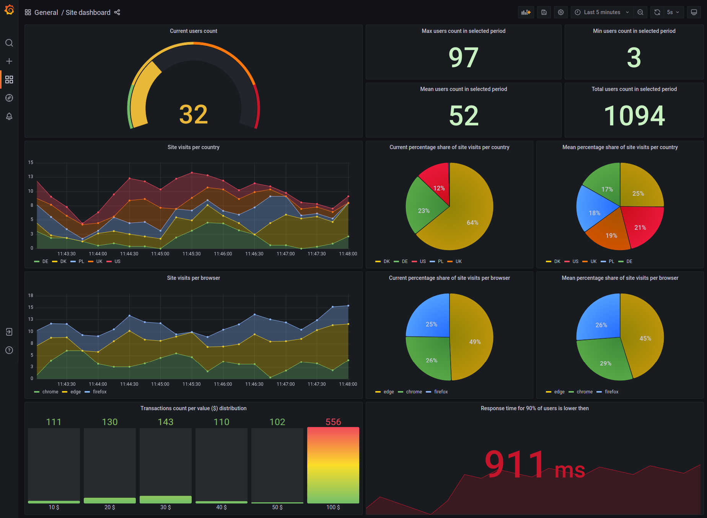

# E2E example Prometheus + Grafana setup
To run this example navigate to `examples/example-04-e2e-prometheus-grafana-setup` and run:
```
npm run start-docker
```

Navigate to: http://localhost:8080 - you should see example metrics that are updated once every 5 seconds

Example dashboard: http://0.0.0.0:3000/d/93nD0kj7z/site-dashboard - you should see example metrics that are updated once every 5 seconds


